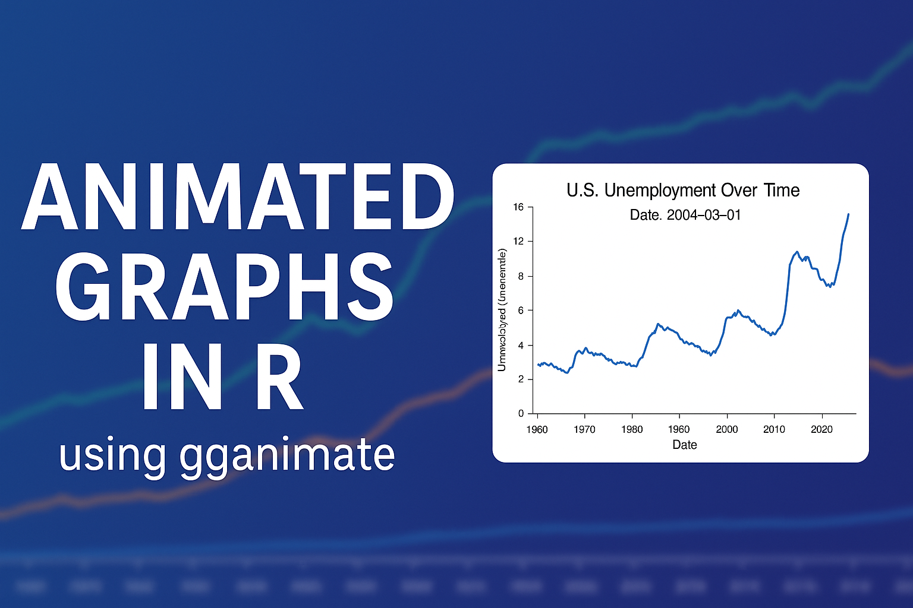

📊 Animated Graphs in R using gganimate

This project demonstrates how to create animated visualizations in R using ggplot2, gganimate, and gifski.
It is designed as a tutorial example and uses the built-in economics dataset from ggplot2.

🚀 Features

Animated Line Chart → U.S. unemployment over time.

Animated Scatter Plot → Relationship between personal savings and unemployment.

Clean, minimal code structure.

Ready-to-use for teaching, YouTube demos, and practice.

📂 Files in this Repository

animated_graphs.R → Main R script.

unemployment_line.gif → Output animation (line plot).

savings_vs_unemployment.gif → Output animation (scatter plot).

thumbnail.png → Intro/thumbnail for YouTube.

README.md → Documentation.

📖 Example Outputs
Unemployment Over Time

Savings vs Unemployment

🛠 Requirements

R (version ≥ 4.0)

R packages:

ggplot2

gganimate

gifski

Install them using:

install.packages(c("ggplot2", "gganimate", "gifski"))

▶️ How to Run

Clone this repository:

git clone https://github.com/WesalMegahed/Animated-Graph-with-R.git

Open animated_graphs.R in RStudio.

Run the script to generate GIF animations.

The outputs will be saved in your working directory.

🎥 YouTube Tutorial
👉 Watch the full step-by-step tutorial here: https://youtu.be/vDS3nUzEij4 

🏷 License

This project is licensed under the MIT License – free to use, modify, and share.
